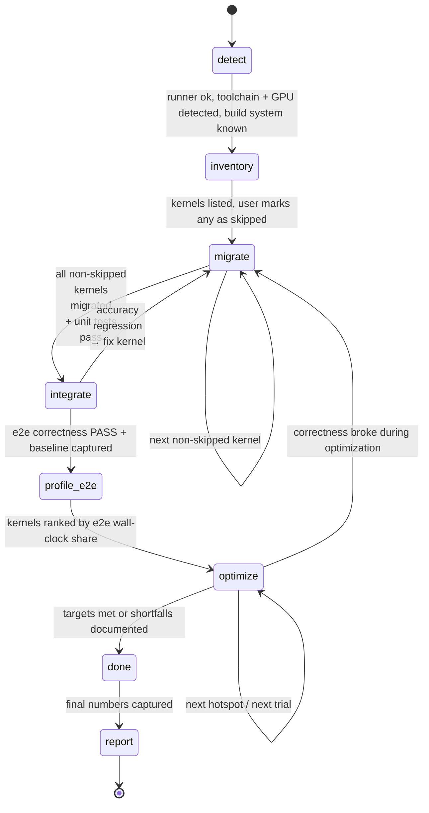

# Migration & Optimization Workflow

The `sycl-agent` orchestrator drives this workflow. Each per-kernel step runs in an **isolated
subagent context** that uses a skill and returns a concise summary. Progress is persisted as JSON
under `.sycl/state/`; `.sycl/PROGRESS.md` is regenerated from it after every change.

## Phase: detect
- Verify the runner: `.sycl/scripts/run.sh env` (local or remote per `.sycl/config.json`).
- Skill `sycl-profiler`: detect `icpx`/oneAPI version, the GPU (`detected_platform` = b60|b70|cri and
  `detected_arch` = xe2|xe3p), and — if benchmarking is planned — whether GPU frequency is pinned
  (unstable clocks corrupt benchmarks).
- **Platform match.** Compare `detected_platform` against `target.platform` in `.sycl/config.json`
  and apply `target.on_mismatch`:
  - `halt` (default) — **stop and surface** detected vs configured. Do not migrate/benchmark: the AOT
    device token, roofline peaks, and SLM/occupancy assumptions are all target-specific, so proceeding
    would produce invalid codegen and meaningless perf numbers. The user fixes `target.*` or overrides.
  - `warn` — log a warning and continue on the **configured** target (caller asserts intent, e.g.
    cross-compiling for a board not attached to the runner).
  - `adopt` — update `target.*` from the detected platform's row in
    `sycl-reference/references/intel-gpu-hardware.md`, log the retarget, and continue.
- Detect the project build system (CMake+CUDA / nvcc / Make / Python/Triton / custom) **and the
  source kernel language(s)**: CUDA (`.cu/.cuh`, `__global__`, `<<<>>>`) and/or Triton (`@triton.jit`,
  `import triton`, `triton.language as tl`). A project may have both.
- **Classify the project `kind`**: **application** (a runnable e2e workload/entrypoint exists — model
  run, driver, demo, or benchmark app) or **library** (exports kernels/ops with no single driver).
  This branches `integrate`, `profile-e2e`, and `report`. When unsure, or when config supplies a
  representative workload / per-kernel call-weights, default to **application**.
- **Discover e2e cases.** Look for runnable workloads/tests (test drivers, `make test`/`ctest`
  targets, example or benchmark scripts, model configs/scenarios). **Resolution:** if
  `config.benchmark.e2e_cases` is non-empty it is authoritative (user override) — use it as-is;
  otherwise record what you discovered in `project.json` `e2e_cases` (`{name, cmd, weight}`, weight
  defaults to 1). Zero or one case = the single-workload path; the multi-case path (below) kicks in
  only when ≥2 cases resolve. The agent never writes `config.json`.
- Record everything (including `env.platform`, `env.arch`, `sources`, `kind`, and `e2e_cases`) in
  `.sycl/state/project.json`; set `phase = inventory`.

## Phase: inventory
- For each detected source language, run the matching analysis skill:
  - Skill `cuda-analysis` — CUDA kernels (`__global__`, `<<<>>>`, `.cu/.cuh`, CUB/cuBLAS/cuDNN/Thrust).
  - Skill `triton-analysis` — Triton kernels (`@triton.jit`, `tl.*`, block pointers/masks, `tl.dot`,
    autotune configs, the launch grid + meta-params).
  Write a single `.sycl/state/kernels/index.json` (each entry tagged with its `source_lang`) and a
  detail file per kernel with algorithm summary, source constructs, IO spec, and risk. If a project
  has both sources, run both skills and merge into the one index.
- **Review gate (non-blocking by default).** Present the list, then **continue immediately** — the
  agent applies its own skip judgement (with a stated reason per skip) and proceeds to `migrate`
  without waiting for confirmation. **Only** pause here for user sign-off if the run was explicitly
  started in review mode (the user asked to review/approve the kernel list first). Skipped kernels
  are never migrated or optimized.
- **Migrate all kernels by default; skipping is the rare exception.** A kernel may be marked
  `skipped` **only** for a concrete structural reason: (a) it is dead / unreachable / never launched,
  (b) it is not actually a GPU kernel (host helper, stub, disabled build variant), or (c) the user
  explicitly excluded it. **Migration difficulty is NEVER a valid skip reason** — `high` risk means
  "port carefully with a solid reference," not "skip." Do not skip a kernel, or a whole batch of
  kernels, because porting them looks risky, complex, or time-consuming; that is the core work.
  A kernel that has no trustworthy correctness reference is `needs-reference` (surfaced), **not**
  `skipped`. Migrating exactly one easy kernel and stopping is a **failure to complete the workflow**,
  not a valid outcome.
- Set `phase = migrate`.

## Phase: migrate (per kernel, lowest risk first)
Skill `sycl-migration`. For each `pending` kernel:
1. **Analyze** the source algorithm (reuse the cuda-analysis / triton-analysis detail). For Triton,
   apply the mental model in `sycl-reference/references/triton-patterns.md` (one Triton program ≈ one
   SYCL work-group owning a tile).
2. **Establish a CPU-oracle reference** for accuracy: write (or reuse the project's) host
   implementation of the kernel math at equal-or-higher precision and compare SYCL against it **live**
   (no golden tensor dump — inputs regenerate from a stored seed + shape + dtype). For Triton
   projects, the project's **PyTorch eager reference** run on CPU is the natural oracle — reuse it and
   its tolerance. Optionally cross-check the CPU reference against the **original kernel** (CUDA
   kernel, or Triton kernel / its torch reference) **once** if a capable host is reachable. If none is
   trustworthy → `status: needs-reference` and surface it (do not fake a pass).
3. **Choose target style** — plain-sycl (default) or sycl-tla for XMX-bound tiled tensor algebra
   (GEMM/attention) per the decision rule in `sycl-reference/references/sycl-tla-patterns.md`. Record
   `target_style`. Pragmatic path: migrate a correct plain-SYCL version first; defer any sycl-tla
   re-target to the optimize phase.
4. **Translate** to hand-written, **idiomatic** SYCL 2020 (never dpct/SYCLomatic): parallel
   reductions via group collectives (not serial loops), library GEMM via oneMKL/oneDNN or sycl-tla
   (not naive triple loops) — see the required recipes in `sycl-reference/references/sycl-kernel-patterns.md`.
5. **Build setup** — add SYCL as a **backend that mirrors the CUDA structure** (same file names +
   launcher signatures, shared host/driver code, backend switch) and **extend the project's existing
   build** (e.g. a SYCL rule beside the `nvcc`/CMake one) rather than forking a standalone SYCL
   project. **This side-by-side rule is mandatory for both `application` and `library` kinds:** the
   SYCL kernels must be wired into the **same e2e / benchmark code path as CUDA** (application driver
   or library benchmark harness), selectable by a backend switch — never a separate SYCL-only path.
   Mirror the test harness at the parallel path (`dev/cuda/<k>.cu` → `dev/sycl/<k>.cpp`),
   inheriting its reference + tolerance. Fall back to a self-contained SYCL subtree only when the CUDA
   structure genuinely cannot be mirrored (e.g. pure-Python Triton, no C/C++ host). For sycl-tla
   targets, add the header-only sycl-tla include dir (from config `targets.sycl_tla.include`).
6. **Unit test** vs the **inherited** reference within its documented tolerance (do not loosen it);
   build + run via `run.sh`.
7. On green: update the kernel detail (`status: migrated`, `source_lang`, `target_style`), regenerate
   PROGRESS.md, `git commit`.
8. **Regression**: previously passing kernel tests must still pass.
Exit when all non-skipped kernels are `migrated` → `phase = integrate`.

## Phase: integrate
Skill `sycl-profiler`. Build the whole SYCL project **through the same e2e/benchmark path as CUDA**
(the backend switch from `migrate`, not a SYCL-only fork). Then, by `kind`:
- **application** — run/author e2e correctness vs reference within tolerance; capture a performance
  baseline for the whole workload. **If the project has multiple e2e cases** (the resolved set —
  `config.benchmark.e2e_cases` if non-empty, else `project.json` `e2e_cases`), **every case is a
  correctness gate — all must pass** — and baseline each case.
- **library** — build the whole SYCL library and run its own test suite if it ships one; otherwise use
  the **aggregate of the per-kernel unit tests** from `migrate` as the correctness gate. Capture a
  baseline by timing the kernel-benchmark suite (representative shapes).

On accuracy regression, send the offending kernel back to `migrate`. Else `phase = profile-e2e`.

## Phase: profile-e2e
Skill `sycl-profiler`. Produce the optimization ranking in `.sycl/state/profile/e2e.json` (descending
share = priority) and snapshot it to `profile/e2e.baseline.json` (immutable). By `kind`:
- **application** (`basis: e2e-workload`) — profile the e2e workload and attribute wall-clock to
  kernels. **Scope the collection** — tracing the full workload can crash unitrace (OOM/core dump);
  trace only a few representative iterations (`--start-paused` + session `--resume/--pause/--stop`, or
  in-app `PTI_ENABLE_COLLECTION`) with `--include-kernels`, or fall back to lightweight in-app device
  timers. **With multiple e2e cases**, profile each and **sum per-kernel wall-clock across cases
  (weighted by each case's `weight`) into one ranking** — keep a single optimization order; record the
  cases in `e2e.json` `cases`.
- **library** (`basis: kernel-suite`) — there is no single workload to attribute, so rank kernels by
  their **own benchmark runtime** at representative shapes (times a per-kernel call-weight if config
  supplies one). Every exported kernel is a deliverable, so effectively all are optimized; the ranking
  just orders effort (costliest first). Reuse the `bench_<id>` drivers built in `migrate`/`optimize`.

Low-impact kernels may be deferred/skipped for optimization. Set `phase = optimize`.

## Phase: optimize (highest-impact first)
Skill `sycl-optimization`. Walk the ranked list **top-to-bottom**. You do **not** need to re-profile
the whole e2e workload after each kernel: optimizations are kept only if faster, so the absolute
wall-clock of untouched kernels is unchanged and their relative order is stable (Amdahl) — the shares
shift only because the total shrinks. Per-kernel diagnosis (step 0.5 deep profile) is local and
sufficient. **Re-profile e2e mid-stream only after a non-local change** that can affect other kernels
(kernel fusion/removal, a shared buffer/layout change, launch-config changes that move global memory
pressure); when you do, overwrite `e2e.json` (the live ranking) but never the baseline snapshot.

For each hotspot, run the guided-search loop against a **standalone kernel-level benchmark**
(`bench_<id>` — author it if the project lacks one, using representative model-config / general / edge
shapes). **MEASURE and DIAGNOSE always use this kernel benchmark, never the e2e workload** (the e2e
profile only *ranks* kernels): re-running the whole workload to time one kernel is slow, noisy, and
crashes unitrace on large traces. **Diagnose** the root cause first by profiling the kernel benchmark
with `sycl-profiler` deep profiling — HW metric counters + stall sampling + IGC shader/asm dump,
combined into bottleneck class + dominant stall + register-spill flag; unitrace does not crash on a
single-kernel driver so always use it, and build the profiling target **JIT** (no AOT) so the shader
dump is non-empty → apply ONE optimization chosen from that diagnosis → re-test correctness →
re-benchmark across the shape set → `git commit` (keep, if the win holds across shapes) or `git revert`
(reject); record every trial (and the diagnosis) in `.sycl/state/optimization/<id>.json`. Use checkpoint
branches to escape local optima and combination trials to test interacting winners. Stop when target
fraction of roofline is met, returns diminish, or the checklist is exhausted — always recording
`stop_reason`. If an optimization breaks correctness irreparably, send the kernel back to `migrate`.

## Phase: done
Re-profile the e2e workload (application) or re-time the kernel-benchmark suite (library) once and
write `.sycl/state/profile/e2e.final.json` (immutable) so the baseline → final numbers are auditable
end to end. Summarize migrated/skipped/needs-reference
counts, e2e accuracy status, achieved fraction of peak per kernel, overall e2e speedup
(baseline vs final), and links to reports. Regenerate PROGRESS.md. Set `phase = report`.

## Phase: report
Produce a **presentation-ready final report** at `.sycl/reports/FINAL_REPORT.md` from
`.sycl/templates/report.md`. This is the communication deliverable — everything else in `.sycl/` is
working state; this is what a human presents. **Author it only from the authoritative state** (never
invent numbers): `project.json`, `kernels/index.json` + per-kernel details, `profile/e2e.baseline.json`
and `e2e.final.json`, `optimization/<id>.json`, `metrics.json` (agent efficiency & cost), `lessons.md`,
and the git history.

Two audiences, one document:
- **§1 Executive summary — for the boss.** Clear objective, persuasive, simple, accurate. Lead with the
  outcome (overall e2e speedup baseline→final and headline metrics table), correctness status, and a
  one-line bottom line a manager can repeat upward. No jargon; every claim defensible from §3/§4.
- **§2+ Details — for the team.** The **why / what / how**: scope & objectives (why), measured results
  per kernel (what), and the methodology + key-optimization deep dives (how, with the diagnosis→fix→gain
  for each top kernel). Include an honest risks/shortfalls section, lessons learned, and next steps.
  Include **§8 Agent efficiency & cost** from `metrics.json`: total agent time and token/credit spend,
  plus the per-phase breakdown so the expensive stage is visible.

Requirements: quantify against the baseline (show baseline → final and fraction-of-peak); keep it
accurate and traceable (numbers map to state/reports/commits); keep §1 short. `git commit` the report.
`report` is the terminal phase — once the report is committed the workflow is complete.

## Analytics (efficiency & cost)
Orthogonal to the phase machine, the agent records its **own running time and cost** so the migration's
ROI is auditable. At **every phase boundary** bracket the phase with
`.sycl/scripts/metrics.sh start <phase>` / `stop <phase>` (wall-clock time — always exact), and after a
subagent or model interaction call `metrics.sh usage <phase> [--tokens-in/-out N] [--cache-read/-write N]
[--requests N] [--credits X] [--cost-usd X]` with whatever cost figures the engine exposes (a direct
dollar figure is best; else token counts split by cached vs uncached since vendors price caching apart,
and/or GitHub premium requests / AI credits for Copilot — all optional). If the engine does not expose
usage to the agent (Copilot/Trae surface tokens only in their own UI/logs), leave cost fields at 0 and
fold the real numbers in later with `metrics.sh import <usage.json>` instead of self-reporting. Events
append to `.sycl/logs/metrics.jsonl`; `metrics.sh` regenerates the `.sycl/state/metrics.json` rollup,
which reports both **elapsed** (true wall-clock span of the whole run) and **active** (bracketed) time
plus the per-phase breakdown.
It surfaces in PROGRESS.md and becomes §8 of the final report. See `state-model.md` → Analytics.

## Invariants
- **Autonomous run:** once started, the workflow runs continuously to `report` without pausing
  between steps/phases for confirmation. The only legitimate stops are a platform-mismatch `halt`, an
  unresolvable blocker (runner unreachable, `needs-reference`, unfixable failure), or an explicit
  user-requested review gate. A progress checkpoint is not a stop.
- One phase active at a time; one kernel / one optimization changed at a time.
- Structured JSON state is authoritative; PROGRESS.md always regenerated to match.
- Every accepted change is a git commit; every decision/result is a JSONL log entry.
- The whole workflow is resumable from `.sycl/state/` + git history.
- **Every phase is bracketed** by `metrics.sh start/stop` and its AI cost recorded via `metrics.sh
  usage`, so agent time + token/credit spend roll up per phase and in total.
- **Accuracy** compares SYCL vs the CPU-oracle reference (live, ground-truth math). **Performance** is
  judged vs the SYCL baseline and the hardware roofline.
