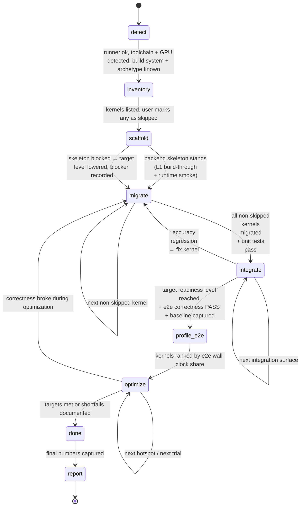

# Migration, Integration & Optimization Workflow

The `sycl-agent` orchestrator drives this workflow. Each per-kernel step runs in an **isolated
subagent context** that uses a skill and returns a concise summary. Progress is persisted as JSON
under `.sycl/state/`; `.sycl/PROGRESS.md` is regenerated from it after every change.

> **The deliverable is a working backend, not a kernel layer.** A migration that leaves the project
> unable to run on the Intel GPU has not delivered what the user wanted. The `scaffold` and
> `integrate` phases exist to make that outcome measurable: depth is recorded as a **Backend
> Readiness Level** (L0 kernel-standalone … L4 workload-fast), declared before the work and computed
> from evidence after it. See skill `sycl-integration` → `references/backend-readiness.md`.



## Every phase boundary is a gate

A phase is not left because the agent believes it is finished. It is left because its **exit
criteria** were checked and met:

```bash
.sycl/scripts/evidence.sh enter <phase>     # stamp entry (E16 measures work done inside the window)
#   ... the phase's work ...
.sycl/scripts/evidence.sh gate  <phase>     # check the criteria; mark exited ONLY if they are met
```

`gate` is the only thing that may set a phase to `exited`. It records **every** attempt in
`state/phases.json`, so a phase that passed on the third try is visibly a phase that was refined
twice. On failure the agent has exactly two options — fix the gap, or record a waiver with a
`reason` and a `blast_radius` — and then re-gates. After `max_gate_attempts` it stops refining,
records the unmet criteria as a blocker, and continues.

> **Why this exists.** The evidence checks E1–E14 all ask *"you claimed X — show the record"*, so
> they can only fire on a sentence somebody wrote. They cannot fire on a sentence nobody wrote. A
> real run migrated every kernel, passed every test, had **every claim mechanically verified** —
> and had deferred the entire optimization phase and never run the project end-to-end. The audit saw
> nothing, because a skipped phase makes no claim to falsify. Silence used to be free.

The criteria are enumerated in skill `sycl-review` →
`references/phase-exit-criteria.md`. After the mechanical gate passes, the `sycl-review` skill
adjudicates what a machine cannot — whether a waiver's reason is real, whether the oracle is
independent, whether the prose outruns the evidence — and records a verdict. It runs with **fresh
context** and may not override a gate failure.

## Phase: detect
- Verify the runner: `.sycl/scripts/run.sh env` (local or remote per `.sycl/config.json`).
- Skill `sycl-profiler`: detect `icpx`/oneAPI version, the GPU (`detected_platform` = b60|b70|cri and
  `detected_arch` = xe2|xe3p), and — if benchmarking is planned — whether GPU frequency is pinned
  (unstable clocks corrupt benchmarks).
- **Platform match.** Compare `detected_platform` against `target.platform` in `.sycl/config.json`
  and apply `target.on_mismatch`:
  - `halt` (default) — **stop and surface** detected vs configured. Do not migrate/benchmark: the AOT
    device token, roofline peaks, and SLM/occupancy assumptions are all target-specific, so proceeding
    would produce invalid codegen and meaningless perf numbers. The user fixes `target.*` or overrides.
  - `warn` — log a warning and continue on the **configured** target (caller asserts intent, e.g.
    cross-compiling for a board not attached to the runner).
  - `adopt` — update `target.*` from the detected platform's row in
    `sycl-reference/references/intel-gpu-hardware.md`, log the retarget, and continue.
- Detect the project build system (CMake+CUDA / nvcc / Make / Python/Triton / custom) **and the
  source kernel language(s)**: CUDA (`.cu/.cuh`, `__global__`, `<<<>>>`) and/or Triton (`@triton.jit`,
  `import triton`, `triton.language as tl`). A project may have both.
- **Classify the project `kind`**: **application** (a runnable e2e workload/entrypoint exists — model
  run, driver, demo, or benchmark app) or **library** (exports kernels/ops with no single driver).
  This branches `integrate`, `profile-e2e`, and `report`. When unsure, or when config supplies a
  representative workload / per-kernel call-weights, default to **application**.
- **Classify the integration `archetype`** (skill `sycl-integration` →
  `references/integration-archetypes.md`): A = C/C++ app with a backend seam, B = C++ library with
  CMake + its own tests, C = framework custom-op extension (PyTorch/TF), D = Python array/JIT
  library, E = runtime/JIT-codegen system, F = graph/parser-driven engine. `kind` says whether there
  is a workload to measure; `archetype` says what it takes to make the workload *run*. If
  `config.integration.archetype` is set it is authoritative. Record it (plus a one-line reason) in
  `project.json` `integration.archetype` — the full plan is built at `scaffold`.
- **Identify the real entrypoint** — the command a *user* runs (not a test binary). It is the L3 gate
  later, and knowing it now shapes every wiring decision. Record it in `integration.entrypoint`.
- **Discover e2e cases.** Look for runnable workloads/tests (test drivers, `make test`/`ctest`
  targets, example or benchmark scripts, model configs/scenarios). **Resolution:** if
  `config.benchmark.e2e_cases` is non-empty it is authoritative (user override) — use it as-is;
  otherwise record what you discovered in `project.json` `e2e_cases` (`{name, cmd, weight}`, weight
  defaults to 1). Zero or one case = the single-workload path; the multi-case path (below) kicks in
  only when ≥2 cases resolve. The agent never writes `config.json`.
- Record everything (including `env.platform`, `env.arch`, `sources`, `kind`, and `e2e_cases`) in
  `.sycl/state/project.json`.
- **Capture the machine fingerprint**: `.sycl/scripts/evidence.sh env` writes
  `.sycl/reports/evidence/env/env-<sha8>.json` and prints its id — store it in `project.json`
  `env.evidence`. Every later test/bench/e2e record is stamped with the current fingerprint, which is
  what lets a reviewer see that a baseline and a final number were measured on the same machine with
  the same toolchain. If GPU frequency is not pinned, that is captured here too, and every benchmark
  built on it is flagged `unstable` rather than silently presented as reproducible.
- Set `phase = inventory`.

## Phase: inventory
- For each detected source language, run the matching analysis skill:
  - Skill `cuda-analysis` — CUDA kernels (`__global__`, `<<<>>>`, `.cu/.cuh`, CUB/cuBLAS/cuDNN/Thrust).
  - Skill `triton-analysis` — Triton kernels (`@triton.jit`, `tl.*`, block pointers/masks, `tl.dot`,
    autotune configs, the launch grid + meta-params).
  Write a single `.sycl/state/kernels/index.json` (each entry tagged with its `source_lang`) and a
  detail file per kernel with algorithm summary, source constructs, IO spec, and risk. If a project
  has both sources, run both skills and merge into the one index.
- **Review gate (non-blocking by default).** Present the list, then **continue immediately** — the
  agent applies its own skip judgement (with a stated reason per skip) and proceeds to `migrate`
  without waiting for confirmation. **Only** pause here for user sign-off if the run was explicitly
  started in review mode (the user asked to review/approve the kernel list first). Skipped kernels
  are never migrated or optimized.
- **Migrate all kernels by default; skipping is the rare exception.** A kernel may be marked
  `skipped` **only** for a concrete structural reason: (a) it is dead / unreachable / never launched,
  (b) it is not actually a GPU kernel (host helper, stub, disabled build variant), or (c) the user
  explicitly excluded it. **Migration difficulty is NEVER a valid skip reason** — `high` risk means
  "port carefully with a solid reference," not "skip." Do not skip a kernel, or a whole batch of
  kernels, because porting them looks risky, complex, or time-consuming; that is the core work.
  A kernel that has no trustworthy correctness reference is `needs-reference` (surfaced), **not**
  `skipped`. Migrating exactly one easy kernel and stopping is a **failure to complete the workflow**,
  not a valid outcome.
- **Measure the migrated code volume**: `bash .sycl/scripts/loc.sh all`. Each kernel's `source`
  symbols are resolved to line spans and counted (comments/blanks excluded) into its `loc` block, and
  rolled up to `.sycl/state/loc.json`. Fix any `loc.unresolved` entries (wrong symbol name, or a
  source the `source` field does not name — add it to `loc.source_spec`) before moving on; an
  unresolved span is silently uncounted. This is the source of the report's "lines of CUDA/Triton
  migrated" figure, and it is cheapest to get right here, while the sources are open.
- Set `phase = scaffold`.

## Phase: scaffold  (build the backend skeleton BEFORE migrating kernels)
Skill `sycl-integration`. The goal is a **walking skeleton**: the smallest change that makes SYCL a
*real* backend of the project, so every kernel migrated afterwards lands in something live.

> **Why this comes before `migrate`.** When wiring is left until after the kernels are done, it
> reliably never happens: the per-kernel tests are green, the work looks finished, and the project
> ships as a standalone kernel layer that cannot run. Building the skeleton first costs a fraction of
> the time and turns the last mile from a second project into a short walk.

1. **Plan.** Confirm the `archetype`, run the surface scanner
   (`sycl-integration/scripts/scan_integration.sh`), and enumerate the integration **surfaces** into
   `.sycl/state/integration/index.json` — `build`, `runtime`, `memory`, `dispatch`, `hostlib`,
   `package`, `nvonly`. A surface the project does not have is marked with a reason; it is never
   deleted (that is how a denominator gets quietly shrunk). Each surface carries `status`,
   `blocks_level`, an `effort_weeks` range and a `risk`.
2. **Declare the target level.** Write `target_level` + `target_reason` into
   `.sycl/state/integration/readiness.json` per `backend-readiness.md` §"Choosing a target"
   (`config.integration.target_level` overrides). **Never target below L1 without a recorded
   blocker** — L0 is an outcome, not a plan.
3. **Build the skeleton**, in this order: the **backend switch** (in one place, named the way the
   project names its other backends), the **device runtime layer** (device/context/queue-as-stream/
   event/sync, USM alloc + copies, error translation — see `references/device-runtime-layer.md`),
   the **build wiring** (a SYCL rule beside the `nvcc` one, inside the project's own build), and
   **one trivial op driven through the project's own dispatch path**.
4. **Gate — L1 + runtime smoke.** Capture both; store the run ids on `gates.L1` and on the `runtime`
   surface:
   ```bash
   .sycl/scripts/evidence.sh record build backend --label scaffold-l1 \
       -- "<the project's OWN build command, SYCL backend enabled>"
   .sycl/scripts/evidence.sh record integration runtime --label scaffold-smoke \
       --reference "host-computed expected result" \
       -- "<one op through the project's own API: alloc → copy → launch → copy back → verify>"
   ```
   The L1 gate is **the project's own artifact**, not a test binary. Set `achieved_level: "L1"`,
   regenerate PROGRESS.md, commit.
5. **If the skeleton will not stand** (archetype E, or a hard blocker), that *is* the finding: record
   the blocker as a surface with `status: deferred` + an estimate, **lower `target_level` now, with
   the reason**, and proceed — so the rest of the run knows the truth instead of discovering it at
   report time. Time-box this step; it must not consume the run.

Set `phase = migrate`.

## Phase: migrate (per kernel, lowest risk first)
Skill `sycl-migration`. For each `pending` kernel:
1. **Analyze** the source algorithm (reuse the cuda-analysis / triton-analysis detail). For Triton,
   apply the mental model in `sycl-reference/references/triton-patterns.md` (one Triton program ≈ one
   SYCL work-group owning a tile).
2. **Establish a CPU-oracle reference** for accuracy: write (or reuse the project's) host
   implementation of the kernel math at equal-or-higher precision and compare SYCL against it **live**
   (no golden tensor dump — inputs regenerate from a stored seed + shape + dtype). For Triton
   projects, the project's **PyTorch eager reference** run on CPU is the natural oracle — reuse it and
   its tolerance. Optionally cross-check the CPU reference against the **original kernel** (CUDA
   kernel, or Triton kernel / its torch reference) **once** if a capable host is reachable. If none is
   trustworthy → `status: needs-reference` and surface it (do not fake a pass).
3. **Choose target style** — plain-sycl (default) or sycl-tla for XMX-bound tiled tensor algebra
   (GEMM/attention) per the decision rule in `sycl-reference/references/sycl-tla-patterns.md`. Record
   `target_style`. Pragmatic path: migrate a correct plain-SYCL version first; defer any sycl-tla
   re-target to the optimize phase.
4. **Translate** to hand-written, **idiomatic** SYCL 2020 (never dpct/SYCLomatic): parallel
   reductions via group collectives (not serial loops), library GEMM via oneMKL/oneDNN or sycl-tla
   (not naive triple loops) — see the required recipes in `sycl-reference/references/sycl-kernel-patterns.md`.
5. **Land it in the live backend** — the skeleton from `scaffold` already exists, so **register the
   kernel on the project's own dispatch path** as part of migrating it (never "wire it up later"),
   mirroring the CUDA structure: same file names + launcher signatures, shared host/driver code,
   behind the backend switch, built by the project's own build. **This side-by-side rule is mandatory
   for both `application` and `library` kinds:** the SYCL kernels must be reachable from the **same
   e2e / benchmark code path as CUDA**, selectable by the backend switch — never a separate SYCL-only
   path. Mirror the test harness at the parallel path (`dev/cuda/<k>.cu` → `dev/sycl/<k>.cpp`),
   inheriting its reference + tolerance. Fall back to a self-contained SYCL subtree only when the CUDA
   structure genuinely cannot be mirrored (e.g. pure-Python Triton, no C/C++ host) — and when you do,
   record it as an open `dispatch` surface in `integration/index.json`, because that subtree is not
   yet a backend. For sycl-tla targets, add the header-only sycl-tla include dir (from config
   `targets.sycl_tla.include`).
6. **Unit test** vs the **inherited** reference within its documented tolerance (do not loosen it);
   build + run via `run.sh`, **captured as evidence**:
   ```
   .sycl/scripts/evidence.sh record test <kernel-id> --label migrate \
       --reference "<what the oracle is>" --tolerance "rtol=1e-5,atol=1e-6" \
       --tolerance-source "<file the tolerance was inherited from>" \
       -- "<the test command>"
   ```
   Write the printed `run_id` into the kernel's `unit_test.evidence`. The stored verdict is the
   **process exit code**, so "the test passed" stops being an assertion and becomes a record: the raw
   log, the measured error next to the tolerance, the commit, and the machine are all kept. A
   `unit_test.result: pass` with no record fails `evidence.sh verify` (check E1).
7. On green: update the kernel detail (`status: migrated`, `source_lang`, `target_style`), regenerate
   PROGRESS.md, `git commit`.
8. **LOC**: `bash .sycl/scripts/loc.sh kernel <id>` to refresh the `loc` block now that `sycl_impl`
   exists — it counts the SYCL written and re-counts the originals covered (same-named `dev/cuda/*`
   files are matched automatically by the mirror rule).
9. **Regression**: previously passing kernel tests must still pass.
Exit when all non-skipped kernels are `migrated` → `phase = integrate`.

## Phase: integrate  (drive the backend to its target readiness level)
Skills `sycl-integration` (lead) + `sycl-profiler` (baseline capture). `scaffold` proved the skeleton
stands and `migrate` landed the kernels on it; this phase finishes the remaining surfaces and proves
the project **actually runs its own workload** on the Intel GPU.

1. **Close the surfaces.** Work `integration/index.json` in `blocks_level` order (L1 → L2 → L3),
   cheapest-first within a level. Typically: the **host port sweep** (every host TU that the CUDA
   build fed to `nvcc` now has to compile with `icpx` — size it first, it is usually the largest
   single item; see `references/host-port-sweep.md`), **host-library replacement** (Thrust→oneDPL,
   cuBLAS→oneMKL, cuDNN→oneDNN, NCCL→oneCCL — table in `references/device-runtime-layer.md`),
   **memory management** (the project's allocator/pool over USM), **op registration/packaging** for
   framework and Python archetypes, and **NVIDIA-only components** — which are *waived explicitly*
   (`waivers[]` with a blast radius), never silently stubbed. Update each surface's `status` and
   `evidence` as it closes.
2. **Gate — L2 (runtime-live).** Run **the project's own test suite** with the backend selected:
   ```bash
   .sycl/scripts/evidence.sh record integration suite --label l2-suite \
       -- "<ctest / pytest / make test, backend selected>"
   ```
   A `partial` is allowed only with every failure enumerated in `gates.L2.exceptions` with a reason.
   The aggregate of the per-kernel unit tests from `migrate` is **not** an L2 gate — it is L0
   evidence. If the project genuinely ships no suite, say so in `gates.L2.note` and treat the L3
   workload as the gate.
3. **Gate — L3 (workload-correct).** Run the **real entrypoint** and compare against the strongest
   available reference within the project's own tolerance (see `references/e2e-validation.md` for the
   reference-priority order and per-workload recipes — loss curve, greedy decoding, golden artifact…).
   *Liveness is not correctness*: "it ran without crashing" does not pass this gate.
   **If the project has multiple e2e cases** (the resolved set — `config.benchmark.e2e_cases` if
   non-empty, else `project.json` `e2e_cases`), **every case is a correctness gate — all must pass**.
   For `library` kind with no driver, the project's own test suite + the kernel-benchmark harness at
   representative shapes stands in for the workload, and the ceiling is L3 by construction.
4. **Capture the baseline** for every case, in the same run or immediately after (this is what
   `profile-e2e` and the final speedup are measured against).
5. **Record the outcome.** Set `achieved_level` from the gates that actually passed, and fill
   `waivers[]` and `residual[]` — the scoped work package for everything not reached (what, what it
   unlocks, `effort_weeks`, risk, prerequisite). A run that stops below target is a legitimate result
   **if and only if** the residual package is there; without it, "we did not finish" is not a
   deliverable.

On accuracy regression, send the offending kernel back to `migrate` — a broken kernel on a required
path **blocks** the level, it does not lower it. Else `phase = profile-e2e`.

**Evidence.** Capture the correctness run and the baseline with
`evidence.sh record e2e <label>` — `--label baseline` for the workload snapshot and
`--label case-<name>` for each e2e case — and store the run ids in `profile/e2e.baseline.json`
(top-level `evidence`, and `cases[].evidence` per case) **and** on `gates.L3.evidence`. Run
`evidence.sh verify` before leaving the phase; a baseline figure with no record is check E4/E2 and
must be re-measured, not re-worded, and a readiness level above what its gates support is check E13.

## Phase: profile-e2e
Skill `sycl-profiler`. Produce the optimization ranking in `.sycl/state/profile/e2e.json` (descending
share = priority) and snapshot it to `profile/e2e.baseline.json` (immutable). By `kind`:
- **application** (`basis: e2e-workload`) — profile the e2e workload and attribute wall-clock to
  kernels. **Scope the collection** — tracing the full workload can crash unitrace (OOM/core dump);
  trace only a few representative iterations (`--start-paused` + session `--resume/--pause/--stop`, or
  in-app `PTI_ENABLE_COLLECTION`) with `--include-kernels`, or fall back to lightweight in-app device
  timers. **With multiple e2e cases**, profile each and **sum per-kernel wall-clock across cases
  (weighted by each case's `weight`) into one ranking** — keep a single optimization order; record the
  cases in `e2e.json` `cases`.
- **library** (`basis: kernel-suite`) — there is no single workload to attribute, so rank kernels by
  their **own benchmark runtime** at representative shapes (times a per-kernel call-weight if config
  supplies one). Every exported kernel is a deliverable, so effectively all are optimized; the ranking
  just orders effort (costliest first). Reuse the `bench_<id>` drivers built in `migrate`/`optimize`.

Low-impact kernels may be deferred/skipped for optimization. Set `phase = optimize`.

**Evidence.** Record **how** wall-clock was attributed in `e2e.json` `method` (`unitrace device-timing`,
`unitrace slice`, or `in-app sycl::event timers`) and reference the e2e run record. Attribution methods
differ in precision and in what they include; naming the method stops the report from overclaiming, and
lets a reviewer judge whether a 3% share is signal or noise.

## Phase: optimize (highest-impact first)
Skill `sycl-optimization`. Walk the ranked list **top-to-bottom**. You do **not** need to re-profile
the whole e2e workload after each kernel: optimizations are kept only if faster, so the absolute
wall-clock of untouched kernels is unchanged and their relative order is stable (Amdahl) — the shares
shift only because the total shrinks. Per-kernel diagnosis (step 0.5 deep profile) is local and
sufficient. **Re-profile e2e mid-stream only after a non-local change** that can affect other kernels
(kernel fusion/removal, a shared buffer/layout change, launch-config changes that move global memory
pressure); when you do, overwrite `e2e.json` (the live ranking) but never the baseline snapshot.

For each hotspot, run the guided-search loop against a **standalone kernel-level benchmark**
(`bench_<id>` — author it if the project lacks one, using representative model-config / general / edge
shapes). **MEASURE and DIAGNOSE always use this kernel benchmark, never the e2e workload** (the e2e
profile only *ranks* kernels): re-running the whole workload to time one kernel is slow, noisy, and
crashes unitrace on large traces. **Diagnose** the root cause first by profiling the kernel benchmark
with `sycl-profiler` deep profiling — HW metric counters + stall sampling + IGC shader/asm dump,
combined into bottleneck class + dominant stall + register-spill flag; unitrace does not crash on a
single-kernel driver so always use it, and build the profiling target **JIT** (no AOT) so the shader
dump is non-empty → apply ONE optimization chosen from that diagnosis → re-test correctness →
re-benchmark across the shape set → `git commit` (keep, if the win holds across shapes) or `git revert`
(reject); record every trial (and the diagnosis) in `.sycl/state/optimization/<id>.json`. Use checkpoint
branches to escape local optima and combination trials to test interacting winners. Stop when target
fraction of roofline is met, returns diminish, or the checklist is exhausted — always recording
`stop_reason`. If an optimization breaks correctness irreparably, send the kernel back to `migrate`.

**Evidence.** Per trial, capture the correctness run and the before/after benchmarks
(`evidence.sh record test|bench <kernel-id> --label trial-<n>-{before,after}`) and store the ids in
`trials[].evidence`; a **kept** trial missing its correctness or post-change bench record fails check
E3. Label the first and last benchmark of the kernel `--label baseline` / `--label final` and point
`performance.evidence` at them — both must carry the **same env fingerprint**, or the speedup compares
two different machines (check E7). After the final deep profile, run:
```
.sycl/scripts/evidence.sh diagnosis <kernel-id>
```
It reads the before/after counter CSVs in `reports/opt_<id>/{baseline,final}/` and puts them beside the
bottleneck you diagnosed, emitting `opt_<id>/DIAGNOSIS.md` with a verdict. This is deliberately
**falsifiable**: if the kernel got faster but the blamed stall never moved, the verdict is
`unexplained` — the speedup is real but the explanation is not, and the reason must be re-diagnosed
before it is generalised into a lesson or repeated on the next kernel.

## Phase: done
Re-profile the e2e workload (application) or re-time the kernel-benchmark suite (library) once and
write `.sycl/state/profile/e2e.final.json` (immutable) so the baseline → final numbers are auditable
end to end. Summarize migrated/skipped/needs-reference
counts, e2e accuracy status, achieved fraction of peak per kernel, overall e2e speedup
(baseline vs final), and links to reports. **Refresh the code-volume rollup** with
`bash .sycl/scripts/loc.sh all` so `.sycl/state/loc.json` reflects the final tree (every SYCL file
written, every original covered).

**Settle the readiness level.** If L3 passed and both `e2e.baseline.json` and `e2e.final.json` exist
from the same environment fingerprint, set `gates.L4: pass` (evidence = both run ids) and
`achieved_level: "L4"` — that, and only that, licenses an "N× end-to-end speedup" sentence. Otherwise
leave `achieved_level` where the evidence puts it and make sure `residual[]` says what the next step
would be. Mirror `archetype` / `target_level` / `achieved_level` into `project.json` `integration`.
Regenerate PROGRESS.md. Set `phase = report`.

**Evidence gate.** Capture the final e2e snapshot as a record (`--label final`), then run:
```
.sycl/scripts/evidence.sh manifest    # hash every artifact under reports/
.sycl/scripts/evidence.sh verify      # re-hash logs, re-check every claim
```
`verify` exits non-zero while any claim is unbacked. **Resolve failures by capturing the missing
evidence — never by deleting the claim or blurring its number.** Removing a result to make the gate
pass is the one behaviour this whole mechanism exists to prevent.

## Phase: report
Produce a **presentation-ready final report** at `.sycl/reports/FINAL_REPORT.md` from
`.sycl/templates/report.md`. This is the communication deliverable — everything else in `.sycl/` is
working state; this is what a human presents. **Author it only from the authoritative state** (never
invent numbers): `project.json`, `kernels/index.json` + per-kernel details, `profile/e2e.baseline.json`
and `e2e.final.json`, `optimization/<id>.json`, `metrics.json` (agent efficiency & cost),
`loc.json` (code volume migrated), `lessons.md`, and the git history.

Two audiences, one document:
- **§1 Executive summary — for the boss.** Clear objective, persuasive, simple, accurate. Lead with the
  outcome (overall e2e speedup baseline→final and headline metrics table), correctness status, and a
  one-line bottom line a manager can repeat upward. No jargon; every claim defensible from §3/§4.
- **§2+ Details — for the team.** The **why / what / how**: scope & objectives (why), measured results
  per kernel (what), and the methodology + key-optimization deep dives (how, with the diagnosis→fix→gain
  for each top kernel). Include an honest risks/shortfalls section, lessons learned, and next steps.
  State the **code volume migrated** from `loc.json` (CUDA/Triton code lines covered → SYCL code lines
  written, and the share of the project's kernel code) — it is what sizes the effort for a reader.
  Include **§8 Agent efficiency & cost** from `metrics.json`: total agent time and token/credit spend,
  plus the per-phase breakdown so the expensive stage is visible.

**Backend integration status is mandatory**, generated from `integration/readiness.json`: achieved vs
target level, the surface table, the explicit **waivers** (what is stubbed/disabled and its blast
radius), and the **residual work package** with effort ranges. And the **claim licence** binds §1:

| Sentence | Requires |
|---|---|
| "the kernels are ported and validated" | L0 |
| "the project builds with the SYCL backend" | L1 |
| "the SYCL backend is live in the project's runtime" | L2 |
| "**\<project\> runs on Intel GPU**" | **L3** |
| "we measured an N× end-to-end speedup" | L4 |
| any "vs NVIDIA" number | an actual A/B record |

Writing a sentence above the achieved level is check **E14** and fails `verify`. The fix is to lower
the sentence or raise the evidence — a scoped, honest L1 with a costed residual package is a
respectable result; an unearned "runs on Intel GPU" is the one failure this framework exists to
prevent.

Requirements: quantify against the baseline (show baseline → final and fraction-of-peak); keep it
accurate and traceable (numbers map to state/reports/commits); keep §1 short.

**Evidence.** Cite the backing **run id** beside each headline number in §3 so the claim is traceable
(check E8 fails a citation that names no known record). Then generate the reviewer's index:
```
.sycl/scripts/evidence.sh audit       # -> .sycl/reports/AUDIT.md
```
`FINAL_REPORT.md` is the argument; `AUDIT.md` is the apparatus — it answers *how do I know the tests
passed*, *are the benchmark numbers real*, and *did the optimization go in the right direction*, with
a link to the raw log behind each answer. `git commit` **both**. A report shipped without its audit
index asks to be trusted; shipped with it, it asks to be checked.
`report` is the terminal phase — once the report is committed the workflow is complete.

## Analytics (efficiency & cost)
Orthogonal to the phase machine, the agent records its **own running time and cost** so the migration's
ROI is auditable. At **every phase boundary** bracket the phase with
`.sycl/scripts/metrics.sh start <phase>` / `stop <phase>` (wall-clock time — always exact), and at every
phase exit run `.sycl/scripts/collect-usage.sh collect --import` to harvest **real token/cost usage from
the engine's own session store** (Claude Code `~/.claude`, opencode's session DB, Copilot's
`~/.copilot/session-store.db`, Trae window logs). The collector timestamps every record into the phase
that was open then, and de-duplicates by the engine's record id, so it is safe to run repeatedly. This
is the primary path: most engines never report usage back to the model, so waiting for the agent to
self-report loses the data entirely.

Only when the collector finds nothing for the engine in use, call
`metrics.sh usage <phase> [--tokens-in/-out N] [--cache-read/-write N] [--requests N] [--credits X]
[--cost-usd X]` with whatever cost figures the engine exposes to the agent (a direct dollar figure is
best; else token counts split by cached vs uncached since vendors price caching apart, and/or GitHub
premium requests / AI credits for Copilot — all optional). Never fabricate counts: if no number is
available, leave the field at 0 and say so in the report. Claude Code, opencode and the Copilot CLI log
exact per-request tokens; VS Code Copilot **chat** and Trae log none, so for those the collector records
the exact countable unit instead (user prompts / premium requests and model round-trips) — VS Code
Copilot tokens can additionally be estimated under `--estimate-tokens` (labelled as an estimate wherever
they appear), while Trae's encrypted conversation store makes even that impossible. On opencode,
`collect-usage.sh stats save baseline` / `stats diff baseline` cross-checks the imported total against
the engine's own `opencode stats` counters.

Events append to `.sycl/logs/metrics.jsonl`; `metrics.sh` regenerates the `.sycl/state/metrics.json`
rollup, which reports both **elapsed** (true wall-clock span of the whole run) and **active**
(bracketed) time plus the per-phase breakdown.
It surfaces in PROGRESS.md and becomes §8 of the final report. See `state-model.md` → Analytics.

## Invariants
- **Autonomous run:** once started, the workflow runs continuously to `report` without pausing
  between steps/phases for confirmation. The only legitimate stops are a platform-mismatch `halt`, an
  unresolvable blocker (runner unreachable, `needs-reference`, unfixable failure), or an explicit
  user-requested review gate. A progress checkpoint is not a stop.
- **Config-gated guardrails** (`config.json` → `guardrails`, opt-in per engine; tighten only):
  - **`gpu_hang_recovery`** — when a routed command hangs on the GPU, recover **only** by killing the
    process (SIGTERM→SIGKILL, incl. descendants). **Never** touch the GPU driver/device (no module
    reload, no GPU/FLR reset, no `xpu-smi`/`intel_gpu_reset`, no reboot). If it will not die, **stop
    and report** the blocker (hung PID + last command) — do not escalate.
  - **`no_lazy_completion`** — migrate/optimize **every** non-skipped kernel, drive the backend to its
    declared `target_level`, and finish through `report`; difficulty/priority/complexity is never a
    skip or early-stop reason. Falling short of the target level is acceptable only with the blocker
    recorded and a costed residual work package. Only the legitimate stops above end a run. **A phase
    is never skipped** — a phase that cannot be run is marked `waived` with a reason and a blast
    radius, which is a decision; passing over it in silence is the failure mode `gate` exists to
    stop.
- One phase active at a time; one kernel / one optimization changed at a time.
- Structured JSON state is authoritative; PROGRESS.md always regenerated to match.
- Every accepted change is a git commit; every decision/result is a JSONL log entry.
- **No claim without a record.** Every `unit_test.result` and every performance figure written to state
  is produced by an `evidence.sh record` invocation whose run id is stored in the matching `evidence`
  field. `evidence.sh verify` is a **phase-exit gate** for `scaffold`, `integrate`, `optimize` and
  `done`. See `evidence-model.md`.
- **No phase without a gate.** Every phase is entered with `evidence.sh enter <phase>` and left with
  `evidence.sh gate <phase>`, which checks that phase's completion criteria and marks it exited only
  if they are met or explicitly waived. `verify` asks *"is what you said true?"*; `gate` asks *"did
  you do the thing this phase exists to do?"* — a phase skipped in silence passes the first and fails
  the second. Criteria are listed in `skills/sycl-review/references/phase-exit-criteria.md`; the
  audit re-derives them as checks **E15** (exited without meeting its criteria), **E16** (an
  execution phase that produced no run record at all) and **E17** (a work item that left the
  inventory with no recorded scope change).
- **A failed gate is a work item, not a verdict.** Fix the gap, or record a waiver with a `reason`
  and a `blast_radius`, then re-gate. After `max_gate_attempts` (default 2), **stop refining**:
  record the unmet criteria as a blocker, mark the phase `waived`, and carry on. Looping on a gate
  spends the budget the remaining phases need.
- **The deliverable is a working backend.** A run whose kernels all pass their unit tests but whose
  project cannot build or run with the SYCL backend has produced L0 \u2014 a kernel layer, not a backend.
  `scaffold` exists so this is discovered in hour one rather than at report time.
- **Readiness is computed, never asserted.** `achieved_level` is the highest level whose gate \u2014 and
  every gate below it \u2014 is `pass` with a resolvable run record. Declared `target_level` may be lowered
  **only** at the moment the blocker is found, with the reason recorded; never at report time.
- **Integration difficulty is never a reason to stop**, exactly as migration difficulty is never a
  reason to skip a kernel. When a surface is genuinely out of scope it becomes a **waiver** (with a
  blast radius) or a **residual work item** (with an effort range and what it unlocks) \u2014 both visible
  in the report. A silent stub is a defect; a recorded waiver is a scoped engagement.
- **Never fork the project.** A standalone SYCL tree that the project's own build never compiles is
  L0 no matter how much code it contains. The gate is always the project's own artifact, its own test
  suite, its own entrypoint.
- The whole workflow is resumable from `.sycl/state/` + git history.
- **Every phase is bracketed** by `metrics.sh start/stop` and its AI cost collected at phase exit via
  `collect-usage.sh collect --import` (falling back to `metrics.sh usage`), so agent time + token/credit
  spend roll up per phase and in total.
- **Accuracy** compares SYCL vs the CPU-oracle reference (live, ground-truth math). **Performance** is
  judged vs the SYCL baseline and the hardware roofline.
